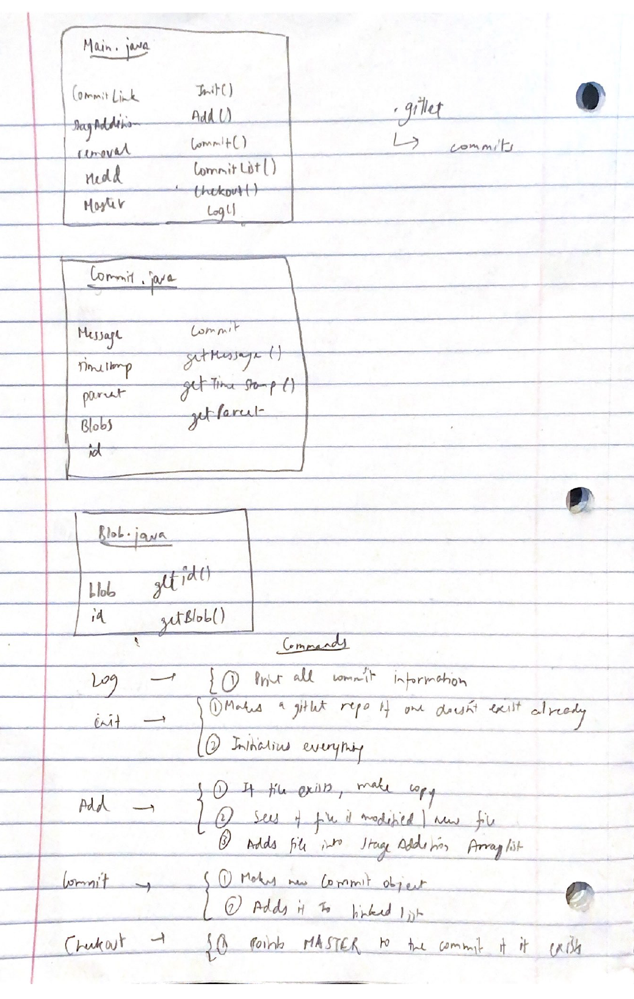

# Gitlet Design Document
author: Agam Gupta

## Design Document 

## 1. Classes and Data Structures

### Main.java
This class is the entry point of the program. It implements methods to set up persistance and support each command of the program.
#### Instance Variables:
1. private LinkedList<Commits> commitLink: linked list of the all the commits
2. private ArrayList<File> stageAddition: list of all files for addition
3. private ArrayList<File> removal: list of all files for removal
4. private Commit Head;
5. private Commit Master;

### Commit.java
This class makes the commit objects. It creates the snapshot of the current code. 

#### Instance Variables:
1. private String Message: String representing the message of each commit 
2. private String timestamp: String representing the timestamp of each commit
3. private Commit parent: Commit object of the parent of the current commit
4. Hashmap <String, Blob> Blobs: hashmaps for containing all blobs
5. private String id: shs-id of the commit

### Blob.java
This class makes the blob objects. 

#### Instance Variables:
1. String blob: stores the string value of the file object passed in
2. String id: stores the sha-id of the blob

## 2. Algorithms

### Main.java
1. Init: checks if there already exists a gitlet version control; If not, mkdir named .gitlet. makes a new commit 0 object and makes a new Linked List with commit 0 as head and tail as null; points the head, master to this commit. 
2. Add: For all files in add: check if file exists, make copy of the file. Sees if the sha-id of each file in the staging exists in the hashmap of blobs. If it does, do not stage.
adds file inputted into the StageAddition arraylist and generates a sha-id for them.
3. Commit: If the staging area is empty, then print "No changes added to the commit." If there is no commit message, print "Please enter a commit message." Clones the commit of parent(HEAD pointer). If it does, the file has not been edited and the new commit object will have the same blob hashmap as its parent but with different timestamp and message. If there is no sha-id found in the head keys, then it makes a new blob object.
4. Commit List(Commit): makes a new linked list with head containing the commit object inputted and tail pointing to the head pointer. If commit has no parent, it does nothing.
5. Checkout(String sha): sees if any of the commits in the commitLink LinkedList have their sha-id same as the inputted one. If yes, then it will point the master to this commit. 
6. Log(): while commit.tail != null, print commit id, timestamp, message 

### Commit.java
1. Commit(String Message, Commit parent): Constructor of the commit class that will assign input message and parent to object's private variables. Also will assign timestamp and generates unique SHA-id for the object. 
2. getMessage(): returns the message of the object
3. getTimeStamp(): returns the timeStamp of the object
4. getParent(): returns the parent of the object

### Blob.java
1. getId(): returns the id of the blob object
2. getBlob: returns the string blob of the object

## 3. Persistence

gitlet --> staging, blobs, commits, 
### Commit: 
After a commit, the staging area arraylist empties out 

### Commit: 
When the new commit object is made, all hashmap value-key pairs are cloned into the new one and then modified based on modification, addition.

## 4. Design Diagram

